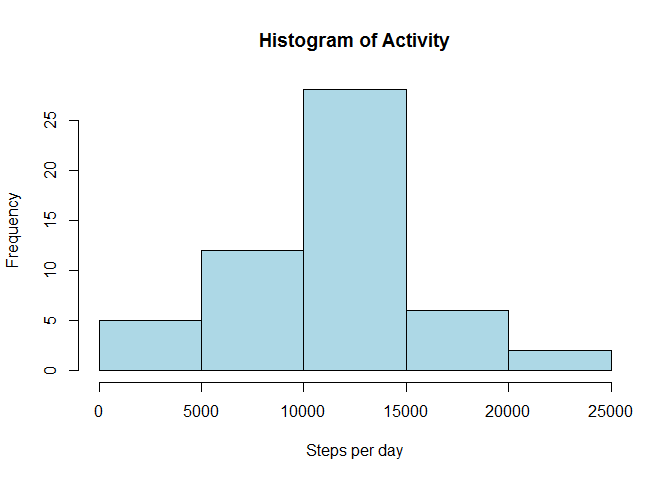
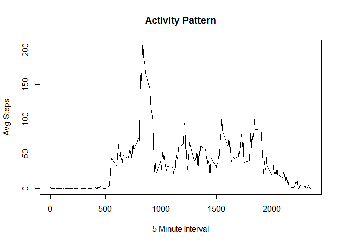
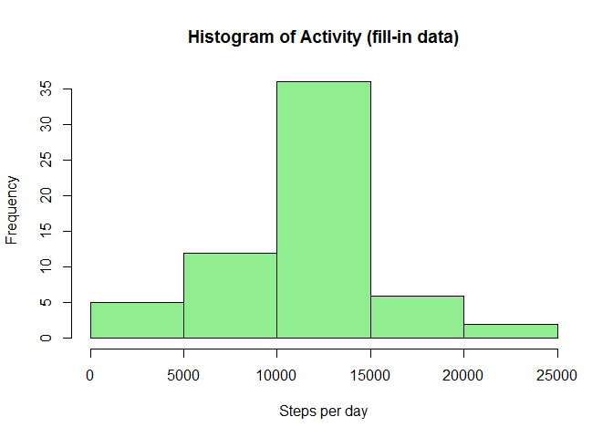

# Reproducible Research: Peer Assessment 1
  
  
## <br/>Loading and preprocessing the data
We will read the raw data into a variable called raw

```r
raw <- read.csv("activity.csv")
```
The raw data has the following structure:

```r
str(raw)
```

```
## 'data.frame':	17568 obs. of  3 variables:
##  $ steps   : int  NA NA NA NA NA NA NA NA NA NA ...
##  $ date    : Factor w/ 61 levels "2012-10-01","2012-10-02",..: 1 1 1 1 1 1 1 1 1 1 ...
##  $ interval: int  0 5 10 15 20 25 30 35 40 45 ...
```


## <br/>What is mean total number of steps taken per day?
In order to answer this question we need to aggregate the raw data by date and compute the sum per day:

```r
data <- aggregate(steps ~ date,sum,data=raw)
```
We can now show the histogram of the data:

```r
hist(data$steps,col="lightblue",xlab="Steps per day",main="Histogram of Activity")
```

 

and the statistical summary:

```r
summ1 <- summary(data$steps)
summ1
```

```
##    Min. 1st Qu.  Median    Mean 3rd Qu.    Max. 
##      41    8841   10760   10770   13290   21190
```

We will save this summary for later use

## <br/>What is the average daily activity pattern?

The following time series is a plot of the 5-minute interval (x-axis) and the average number of steps taken, averaged across all days (y-axis):


```r
means <- aggregate(steps ~ interval,mean,data=raw)
names(means) <- c("interval","avg")
plot(means$interval,means$avg,type="l",xlab="5 Minute Interval",ylab="Avg Steps",main="Activity Pattern")
```

 

This time series exhibits a peak at the following time interval:

```r
row <- which.max(means$avg)
means[row,]
```

```
##     interval      avg
## 104      835 206.1698
```

that is, around 8:35

## <br/>Imputing missing values

The following code computes the number of NAs in the raw data:


```r
table(is.na(raw$steps))
```

```
## 
## FALSE  TRUE 
## 15264  2304
```

In order to analyze the impact of missing values we will fill in those values with the mean of the corresponding 5-minute interval. The following code creates a new dataset that is equal to the original dataset but with the missing data filled in:


```r
tmp <- raw
tmp <- merge(tmp,means,by="interval")
tmp[is.na(tmp$steps),"steps"] <- tmp[is.na(tmp$steps),"avg"]
table(is.na(tmp$steps))
```

```
## 
## FALSE 
## 17568
```

The following is an histogram of the fill in data:


```r
data <- aggregate(steps ~ date,sum,data=tmp)
hist(data$steps,col="lightgreen",xlab="Steps per day",main="Histogram of Activity (fill-in data)")
```

 

The following is a report of the mean and median total number of steps taken per day:

```r
summ2 <- summary(data$steps)
summ2
```

```
##    Min. 1st Qu.  Median    Mean 3rd Qu.    Max. 
##      41    9819   10770   10770   12810   21190
```

If we compare the reports of both datasets, with and without missing values:


```r
rbind(summ1,summ2)
```

```
##       Min. 1st Qu. Median  Mean 3rd Qu.  Max.
## summ1   41    8841  10760 10770   13290 21190
## summ2   41    9819  10770 10770   12810 21190
```

we see that there is no appreciable impact of missing data on the mean and only a slight impact on the median.


## <br/>Are there differences in activity patterns between weekdays and weekends?

To answer this question we will create a new factor variable called "wkend" in the dataset with two levels - "weekday" and "weekend" indicating whether a given date is a weekday or weekend day. Then the data will be aggregated as before by "interval"" and "wkend", computing the average number steps per group:


```r
library(lubridate)
data <- raw
data$wday <- wday(as.Date(data$date))
data$wkend <- as.factor(ifelse(data$wday==1 | data$wday==7,"weekend","weekday"))
data <- aggregate(steps ~ interval + wkend, data=data, mean)
```

The following is a panel plot containing a time series plot (i.e. type = "l") of the 5-minute interval (x-axis) and the average number of steps taken, averaged across all weekday days or weekend days (y-axis):


```r
library(lattice)
with(data,xyplot(steps ~ interval | wkend, layout=c(1,2), type="l"))
```

 

Therefore it can be shown that the activity patterns are in fact different during weekdays and weekends. At a first glance we can see the following differences:

- Activity starts earlier in the morning during weekdays
- There is a peak around 8:35 in both cases, but smaller in weekends. On weekends the maximum occurs later in the morning
- The activity is spread out over the day during weekends, while in weekdays it is more concentrated.

